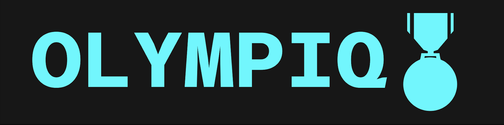
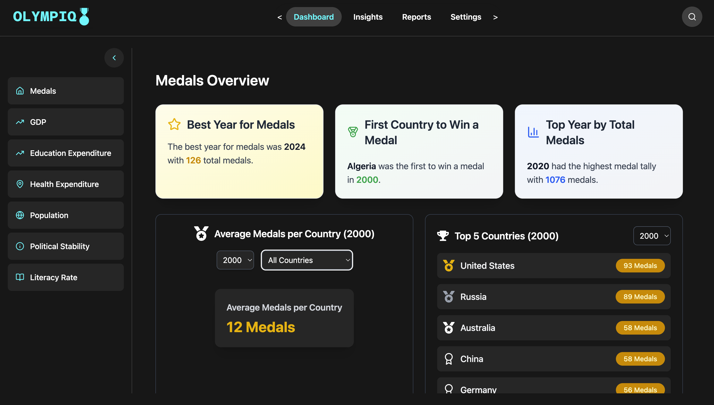

# OlympIQ

This project lies at the intersection of sports analytics, socio-economic development, and public policy evaluation. Our goal is to investigate how key socio-economic factors (GDP, literacy, health expenditure, education, demographic indicators, and social well-being) over each 4-year Olympic cycle influence a country’s performance in the subsequent Olympic Games. We will cover the consecutive Olympic cycles (2000 to 2024) to capture trends and assess the impact of sustained investments on Olympic success.

---

---

## Key Features:
- **Data Analysis**: Investigating how socio-economic factors such as GDP, literacy, and health expenditure influence Olympic success.
- **Multi-Olympic Cycles**: A comprehensive analysis across multiple Olympic Games (2000 to 2024).
- **Interactive Visualizations**: Real-time interactive charts and maps to explore socio-economic trends and Olympic performance.

---

## Project Goals:
- Analyze the impact of sustained socio-economic investments on Olympic performance.
- Develop a data-driven platform for policymakers to evaluate the effectiveness of public policy on sports success.
- Provide insights into how countries can leverage socio-economic factors to improve Olympic performance.

---

## Technologies Used:
- **Frontend**: React (Vite), D3.js, TailwindCSS
- **Backend**: FastAPI, Python (Pandas, NumPy, Machine Learning)
- **Data Sources**: Kaggle Olympic Dataset, World Bank, WHO, UNESCO

---

Explore the OlympIQ project and gain insights into the intersection of sports and socio-economic development.

OLYMPIQ-Presentation Slides [HERE]()
